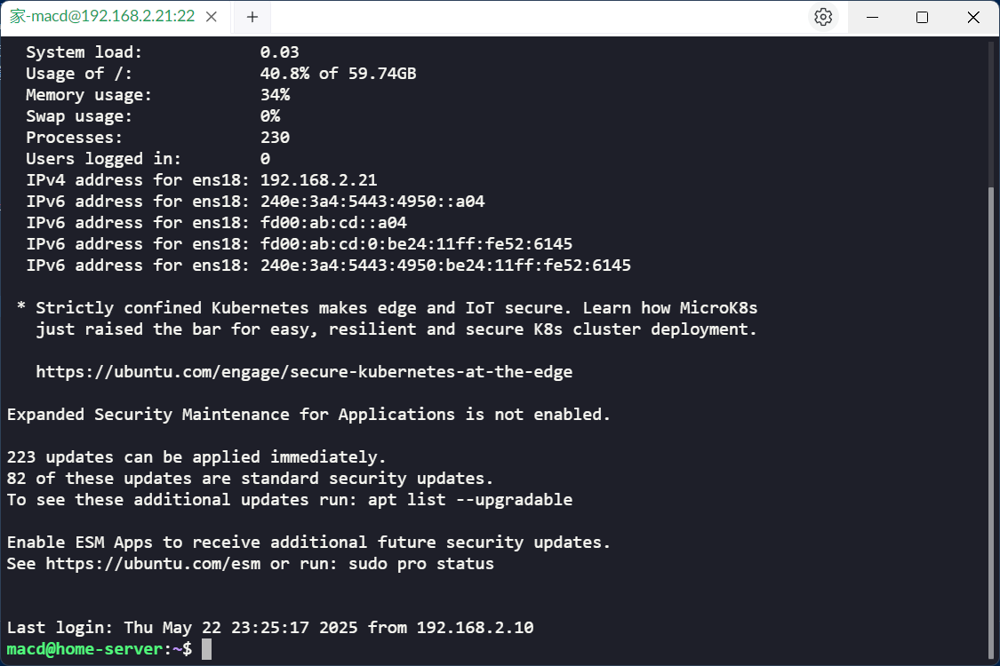
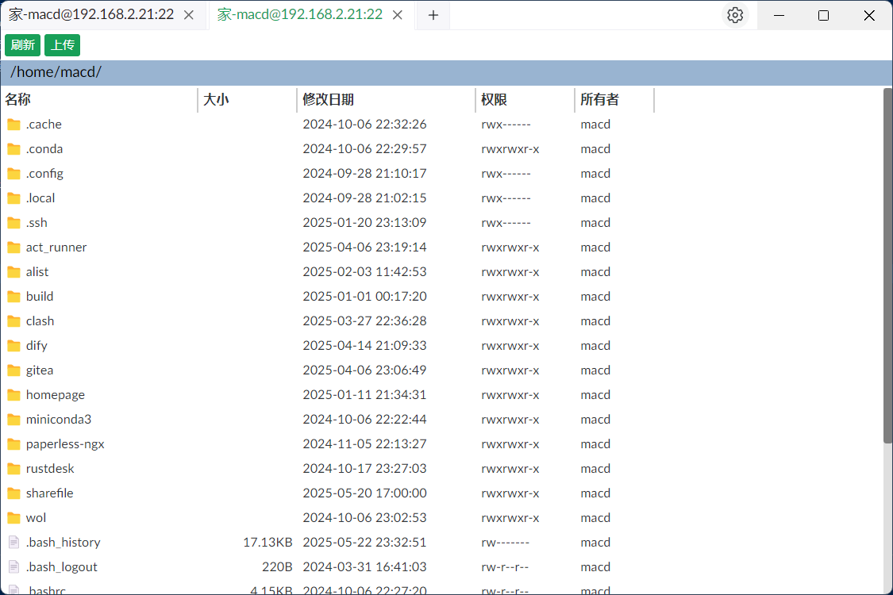

# sshsx

sshsx是一个ssh和sftp客户端工具，用于快速登录服务器。希望是winscp和putty的组合替代。

## 功能点

1. ssh界面
2. sftp界面
   -[x] 文件或文件夹拖拽上传
   -[x] 下载文件或文件夹
   -[x] 删除文件或文件夹
   -[x] 复制粘贴单个文件或文件夹
   -[x] 在编辑器中打开文件，修改后自动上传（代码还需要重构）
3. 设置页面
4. 连接管理页面

## 界面

SSH界面

SFTP界面

